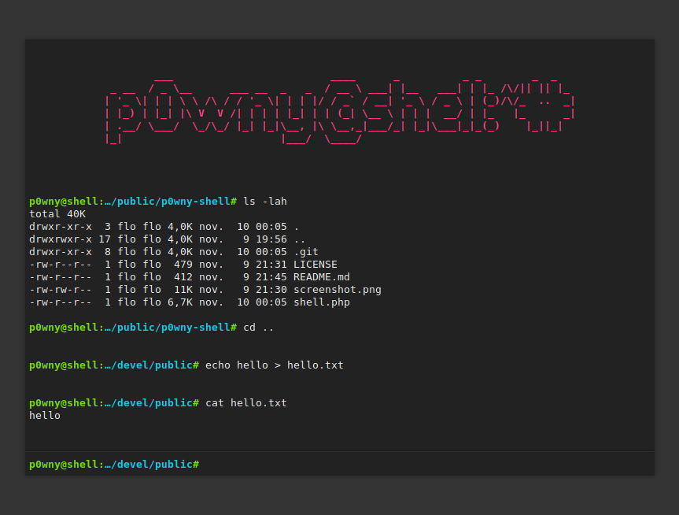

# p0wny@shell-VaultEdition:~# -- Single-file Secured and Hidden PHP Shell

p0wny@shell-VaultEdition:~# is a very basic, single-file, PHP shell. It can be used to quickly execute commands on a server when pentesting a PHP application. Use it with caution: this script represents a security risk for the server.

**Features:**

* Command history (using arrow keys `↑` `↓`)
* Auto-completion of command and file names (using `Tab` key)
* Navigate on the remote file-system (using `cd` command)
* Upload a file to the server (using `upload <destination_file_name>` command)
* Download a file from the server (using `download <file_name>` command)

**WARNING:** THIS SCRIPT IS A SECURITY HOLE. **DO NOT** UPLOAD IT ON A SERVER UNTIL YOU KNOW WHAT YOU ARE DOING!

## Contributing

### Questions

If you have any question, you can:

* [Open an issue](https://github.com/flozz/p0wny-shell/issues) on GitHub
* [Ask on Discord](https://discord.gg/P77sWhuSs4) (I am not always available to chat, but I try to answer to everyone)

### Bugs

Please [open an issue](https://github.com/0x06060606/p0wny-shell-VaultEdition/issues) on GitHub with as much information as possible if you found a bug:

* Your operating system / Linux distribution (and its version)
* The PHP version you are using (example: `PHP-FPM 8.1`, `Apache mod_php 7.4`,...)
* The Web server you are using and its version (example: `Nginx 1.23`, `Apache 2.4.55`,...)
* All the logs and message outputted by the software
* etc.

### Pull requests

Please consider [filing a bug](https://github.com/0x06060606/p0wny-shell-VaultEdition/issues) before starting to work on a new feature; it will allow us to discuss the best way to do it. It is obviously unnecessary if you just want to fix a typo or small errors in the code.

## Support this project

Want to support this project?

* [❤️ Sponsor me on GitHub](https://github.com/sponsors/0x06060606)

  * Improved handling of stderr (@lo001 #2)
* **v2018.05.30:**
  * ES5 compatibility (@lo00l #1)
  * Dependency to JQuery removed (@lo00l #1)
  * Command history using arrow keys (@lo00l #1)
  * Keep the command field focused when pressing the tab key
* **v2017.10.30:**
  * CSS: invalid color fixed
* **v2016.11.10:**
  * Initial release
